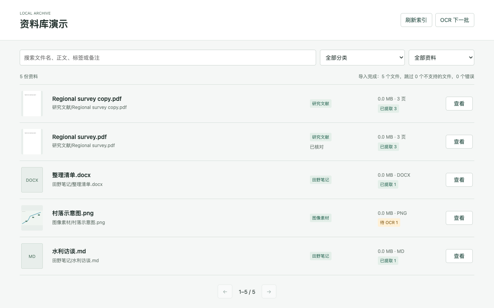

# 文史社科类资料整理流程包

面向文学、历史与社会科学研究的本地资料管理 Skill。英文安装标识：`local-material-library`。

把一整批文献、图片和笔记变成自己的本地资料库：按正文搜索、调整分类和标签、记录备注、查看 PDF 内页、分批识别扫描件。无需云服务器、域名、数据库服务或 AI API Key。

这不是只告诉 AI “帮我建一个网站”的提示词。仓库包含 **Codex Skill + 固定版本依赖 + 可运行应用 + 虚构演示数据生成器 + 回归测试**。同一套代码可直接启动，也可由 Codex 通过 skill 启动。



## 能做什么

| 场景 | 行为 |
| --- | --- |
| 大量文件散落在子文件夹 | 递归导入，子文件夹作为初始分类 |
| 找书中的某句话 | 搜索全部已提取页；结果按文件分页，显示命中页 |
| 扫描书、地图和照片 | 可选本地 Tesseract OCR，每批 50 页，逐页保存并续跑 |
| 想保留原版排版 | PDF 按页渲染，输入页码或点击前后页；图像原图预览 |
| 标签、专题和待办 | 界面编辑分类、标签、备注，刷新索引后保留 |
| 完全重复的文件 | SHA-256 标识重复项，手动隐藏及恢复，绝不自动删原件 |
| 外部移动或更新文件 | 刷新后更新索引；唯一同哈希的移动保留原 ID |

PDF、DOCX、TXT、MD、CSV 和 JPG/PNG/WebP/TIFF/BMP 可导入。DOCX 包括段落与表格文字。CSV 以文字搜索，不提供表格分析。音视频、旧 `.doc`、Excel、压缩包目前跳过。多帧 TIFF 当前只处理首帧，整册扫描建议先转 PDF。

## 直接运行

安装 Python **3.10+**。下载本仓库后，在仓库根目录运行（macOS/Linux 通常使用 `python3`，Windows 使用 `py -3`）：

```sh
python3 skills/local-material-library/scripts/run.py --source "/你的资料文件夹" --data "/你的资料库数据文件夹" --title "我的资料库"
```

Windows 示例：

```powershell
py -3 skills/local-material-library/scripts/run.py --source "D:\Materials" --data "D:\LibraryData" --title "我的资料库"
```

首次运行需要联网下载 Python 依赖。之后基本功能无需联网。打开终端打印的地址，默认是 `http://127.0.0.1:8876/`；端口已占用时会自动选择空闲端口。首次启动自动导入，页面显示进度和错误。保留终端窗口，按 Ctrl+C 停止；下次执行同一条命令即可恢复。新增或调整文件后点击“刷新索引”。

资料目录保存原件，数据目录保存 SQLite 索引。应用不移动、覆盖或删除原件。不要将数据目录放进 GitHub 仓库。不要用现有私人资料库的数据库测试本项目。

## 作为 Codex Skill

把 `skills/local-material-library` 整个文件夹安装到 `~/.codex/skills/local-material-library`。也可以让 Codex 的 skill-installer 从你自己的 GitHub 仓库安装这个子目录。重新打开任务后输入：

> 使用 $local-material-library，把 `/我的资料` 建成本地资料库，数据放在 `/我的资料库数据`，名称叫“我的研究材料”。

Skill 会调用随附应用，获取缺失路径、启动导入并验证搜索与阅读。完整指令见 [SKILL.md](skills/local-material-library/SKILL.md)。普通 Python 用户无需安装 Codex。

## 先用虚构资料试跑

先运行一次上面的启动命令即可安装依赖，或手动建立环境：

```sh
python3 -m venv .venv
.venv/bin/python -m pip install -r skills/local-material-library/requirements.txt
.venv/bin/python skills/local-material-library/scripts/demo.py --output /tmp/library-demo
.venv/bin/python skills/local-material-library/scripts/library.py serve --source /tmp/library-demo --data /tmp/library-demo-data --title "资料库演示"
```

Windows 将 `.venv/bin/python` 换为 `.venv\Scripts\python.exe`，将 `/tmp/...` 换成自己的空目录。

搜索 `WATERMARKET`，会命中 PDF 第 3 页；搜索 `水利`，会命中笔记；选择“完全重复”，会找到两本相同 PDF。编辑标签、刷新索引，标签仍应存在。演示图片和文档由脚本生成，没有真实人物、访谈或受版权限制的书籍。

## OCR、备份与限制

OCR 是可选依赖，需要另装 Tesseract 和语言包。安装方法、指定某本书全页识别、断点续跑、失败重试、迁移与一致性备份见 [工作流说明](skills/local-material-library/references/workflow.md)。

所有 PDF 页都提取已有文字；少于 20 个非空白字符的页列为 OCR 候选。**待 OCR 页仍可能搜不到；“已提取”不代表扫描区域已经识别。** 图文混排或损坏文字层可以按文档强制全页 OCR。古籍、手写字和复杂地图需要人工核对。

当前版本在搜索摘要和提取文字中高亮，原版页用于核对；尚不支持扫描图片上的精准字框高亮。DOCX 的文字视图也不保证原始排版。分类为手工可调整的文件夹分类，没有付费模型自动分类。

搜索采用 SQLite 字面子串查询，支持短中文关键词与结果分页；没有对十万页规模做性能承诺。OCR 为单任务分批执行，不会一次并行占满机器。此版本只面向本机访问，不包含公网部署。

## 开发与复现

```sh
.venv/bin/python -m unittest discover -s tests -v
```

测试覆盖后页命中、结果分页、重导入与移动保留元数据、重复项、隐藏恢复、备份、OCR 续跑状态及本地 HTTP 边界。OCR 状态单元测试使用模拟引擎；识别准确率需用真实 Tesseract 和自己的样本验证。GitHub Actions 在 Windows、macOS 和 Linux 上执行同一组测试；未运行的远端 CI 不视为已通过。

项目目录：

```text
skills/local-material-library/
  SKILL.md                 Codex 工作流入口
  agents/openai.yaml       Skill 展示信息
  requirements.txt         Python 依赖版本
  scripts/run.py           独立环境与启动
  scripts/library.py       导入、查询、OCR、备份、HTTP 服务
  scripts/demo.py          虚构演示资料生成器
  assets/ui/               本地管理界面，无 CDN
  references/workflow.md   维护与故障处理
tests/                     行为回归测试
.github/workflows/         跨平台 CI
```

执行 `python3 scripts/package.py` 会生成 `dist/local-material-library.zip`，只收录明确列出的源码和说明。解压后，将目录中的内容作为 GitHub 仓库根目录上传，不要直接把 ZIP 当作代码仓库提交。也不要上传上一级私人项目、原始资料、运行数据或虚拟环境。依赖遵循各自许可证；本项目源码使用 MIT，见 [LICENSE](LICENSE)。

技术资料：[PDFium Python API](https://pypdfium2.readthedocs.io/en/stable/python_api.html)、[Tesseract 安装与语言包](https://tesseract-ocr.github.io/tessdoc/Installation.html)。
